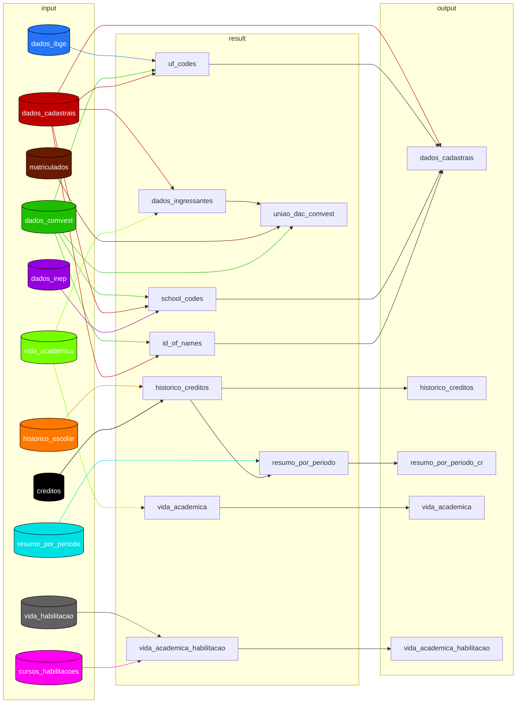

# DAC FlowChart (Needs extension: Markdown Preview Mermaid Support)

```mermaid
flowchart LR
    subgraph input
    dados_ibge[(dados_ibge)]:::blue
    dados_comvest[(dados_comvest)]:::green
    dados_cadastrais_pre_e_pos[(dados_cadastrais)]:::red
    dados_inep[(dados_inep)]:::purple
    resumo_por_periodo[(resumo_por_periodo)]:::cian
    historico_escolar[(historico_escolar)]:::orange
    creditos[(creditos)]:::black
    vida_academica[(vida_academica)]:::lima
    vida_academica_habilitacao[(vida_habilitacao)]:::gray
    habilitacoes[(cursos_habilitacoes)]:::pink
    matriculados_comvest[(matriculados)]:::brown
    end

    subgraph result
    ibge_uf_codes[uf_codes]
    inep_school_codes[school_codes]
    id_of_names[id_of_names]
    historico_creditos[historico_creditos]
    resumo_periodo_result[resumo_por_periodo]
    vida_academica_result[vida_academica]
    dados_ingressantes[dados_ingressantes]
    vida_academica_habilitacao_result[vida_academica_habilitacao]
    uniao_dac_comvest[uniao_dac_comvest]
    end
    
    subgraph output
    dados_cadastrais[dados_cadastrais]
    historico_creditos_output[historico_creditos]
    resumo_periodo_cr[resumo_por_periodo_cr]
    vida_academica_output[vida_academica]
    vida_academica_habilitacao_output[vida_academica_habilitacao]
    end

    %% dados_cadastrais
    dados_ibge --> ibge_uf_codes
    dados_comvest --> ibge_uf_codes & inep_school_codes & id_of_names
    dados_cadastrais_pre_e_pos --> ibge_uf_codes & inep_school_codes & id_of_names & dados_cadastrais & dados_ingressantes
    dados_inep --> inep_school_codes
    ibge_uf_codes --> dados_cadastrais
    inep_school_codes --> dados_cadastrais
    id_of_names --> dados_cadastrais

    %% resumo por periodo
    resumo_por_periodo --> resumo_periodo_result
    resumo_periodo_result --> resumo_periodo_cr

    %% historico escolar
    historico_escolar --> historico_creditos
    creditos --> historico_creditos
    historico_creditos --> historico_creditos_output
    historico_creditos --> resumo_periodo_result

    %% vida_academica
    vida_academica --> vida_academica_result
    vida_academica_result --> vida_academica_output
    vida_academica --> dados_ingressantes

    %% vida_academica_habilitacao
    vida_academica_habilitacao --> vida_academica_habilitacao_result
    habilitacoes --> vida_academica_habilitacao_result
    vida_academica_habilitacao_result ---> vida_academica_habilitacao_output
    
    %% uniao_dac_comvest
    dados_ingressantes --> uniao_dac_comvest
    matriculados_comvest --> uniao_dac_comvest
    dados_comvest --> uniao_dac_comvest

    %% Esquema de cores das bases
    classDef blue fill: #2374f7, stroke: #000, stroke-with: 2px, color: #fff
    classDef green fill: #1FBF00, stroke: #000, stroke-with: 2px, color: #fff
    classDef red fill: #BF0000, stroke: #000, stroke-with: 2px, color: #fff
    classDef purple fill: #9800E1, stroke: #000, stroke-with: 2px, color: #fff
    classDef cian fill: #00DFE1, stroke: #000, stroke-with: 2px, color: #fff
    classDef orange fill: #FF7800, stroke: #000, stroke-with: 2px, color: #fff
    classDef black fill: #000000, stroke: #000, stroke-with: 2px, color: #fff
    classDef lima fill: #76FF00, stroke: #000, stroke-with: 2px, color: #fff
    classDef gray fill: #606060, stroke: #000, stroke-with: 2px, color: #fff
    classDef pink fill: #FF00F0, stroke: #000, stroke-with: 2px, color: #fff
    classDef brown fill: #691B00, stroke: #000, stroke-with: 2px, color: #fff

    %% Esquema de cores das setas
    linkStyle 0 stroke :#2374f7
    linkStyle 1,2,3,27 stroke :#1FBF00
    linkStyle 4,5,6,7,8 stroke :#BF0000
    linkStyle 9 stroke :#9800E1
    linkStyle 13 stroke :#00DFE1
    linkStyle 15 stroke :#FF7800
    linkStyle 16 stroke :#000000
    linkStyle 19,21 stroke :#76FF00
    linkStyle 22 stroke :#606060
    linkStyle 23 stroke :#FF00F0
    linkStyle 26 stroke :#691B00
```