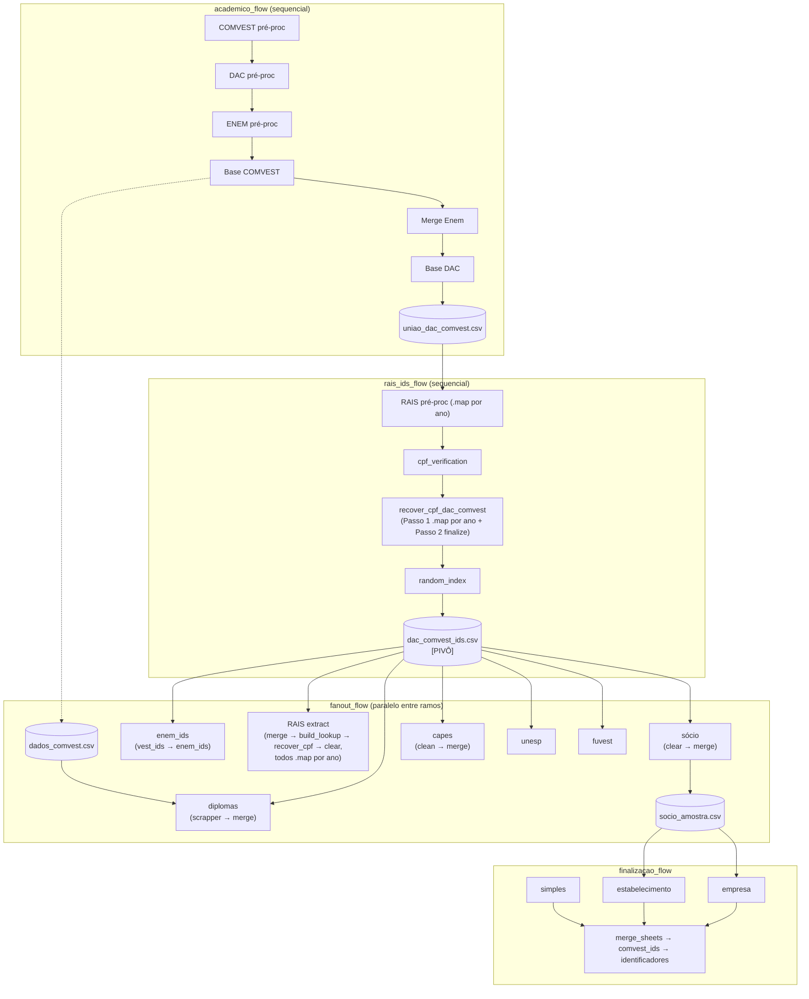

# Fluxo de dados do pipeline (Fase 1 — Prefect)

Diagrama da árvore de dependência real entre os 4 subflows e os principais
artefatos de arquivo (checkpoints em disco), conforme desenhado em
`plan.md` e implementado em `flows/`.

Legenda:
- Nós retangulares = tasks/etapas do Prefect (`flows/tasks/`).
- Nós em formato de "banco de dados" = artefatos de arquivo (checkpoints reais em disco, não estado do Prefect).
- `dac_comvest_ids.csv` é o pivô — todo o `fanout_flow` depende só dele, exceto `diplomas`, que também precisa de `dados_comvest.csv`.
- Etapas marcadas `.map por ano` são as decompostas em tasks paralelas por ano (RAIS pré-processamento, `recover_cpf_dac_comvest`, e o extract final do RAIS); o resto continua sequencial dentro de cada ramo.
