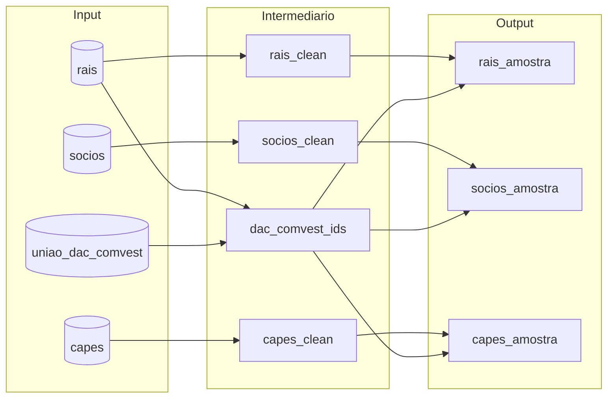

```mermaid
flowchart LR
    subgraph Input
    uniao_dac_comvest[(uniao_dac_comvest)]
    rais[(rais)]
    socios[(socios)]
    capes[(capes)]
    end

    subgraph Intermediario
    dac_comvest_ids[dac_comvest_ids]
    rais_clean[rais_clean]
    socios_clean[socios_clean]
    capes_clean[capes_clean]

    end
    
    subgraph Output
    rais_amostra[rais_amostra]
    socios_amostra[socios_amostra]
    capes_amostra[capes_amostra]
    end

    rais & uniao_dac_comvest --> dac_comvest_ids
    rais --> rais_clean
    socios --> socios_clean
    capes --> capes_clean

    rais_clean & dac_comvest_ids --> rais_amostra
    socios_clean & dac_comvest_ids --> socios_amostra
    capes_clean & dac_comvest_ids --> capes_amostra
```