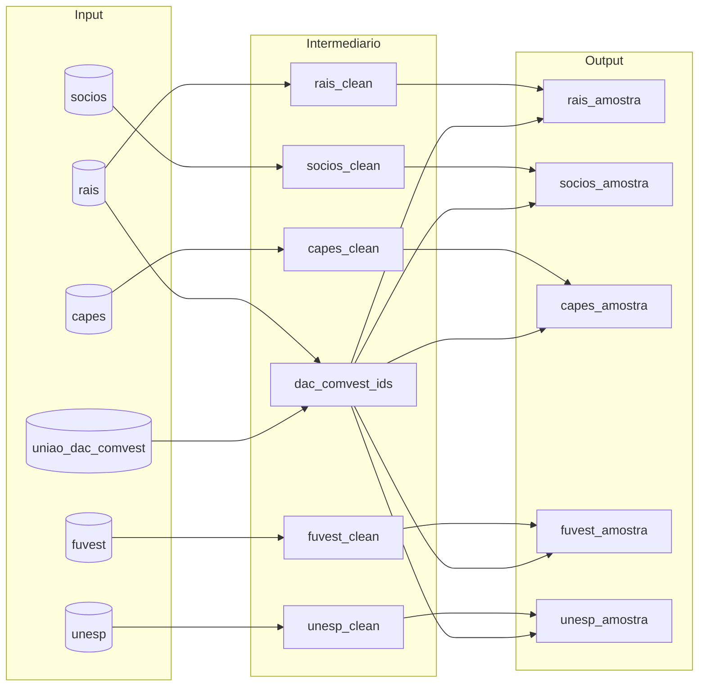

```mermaid
flowchart LR
    subgraph Input
    uniao_dac_comvest[(uniao_dac_comvest)]
    rais[(rais)]
    socios[(socios)]
    capes[(capes)]
    fuvest[(fuvest)]
    unesp[(unesp)]
    end

    subgraph Intermediario
    dac_comvest_ids[dac_comvest_ids]
    rais_clean[rais_clean]
    socios_clean[socios_clean]
    capes_clean[capes_clean]
    fuvest_clean[fuvest_clean]
    unesp_clean[unesp_clean]

    end
    
    subgraph Output
    rais_amostra[rais_amostra]
    socios_amostra[socios_amostra]
    capes_amostra[capes_amostra]
    fuvest_amostra[fuvest_amostra]
    unesp_amostra[unesp_amostra]
    end

    rais & uniao_dac_comvest ---> dac_comvest_ids
    rais ---> rais_clean
    socios ---> socios_clean
    capes ---> capes_clean
    fuvest ---> fuvest_clean
    unesp ---> unesp_clean

    rais_clean & dac_comvest_ids ---> rais_amostra
    socios_clean & dac_comvest_ids ---> socios_amostra
    capes_clean & dac_comvest_ids ---> capes_amostra
    fuvest_clean & dac_comvest_ids ---> fuvest_amostra
    unesp_clean & dac_comvest_ids ---> unesp_amostra

```